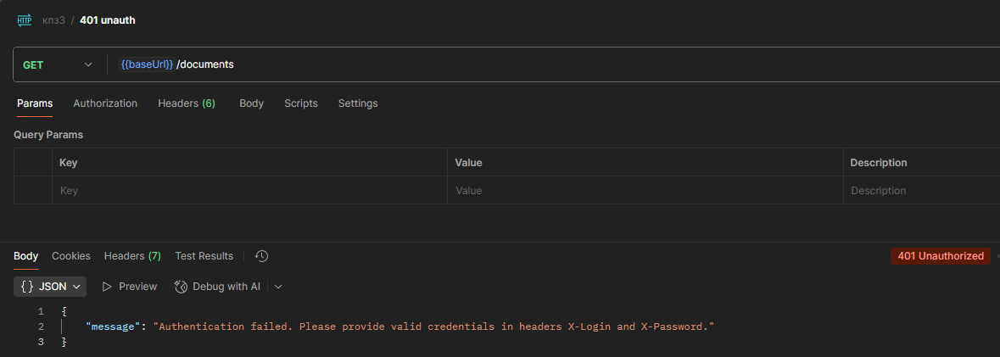
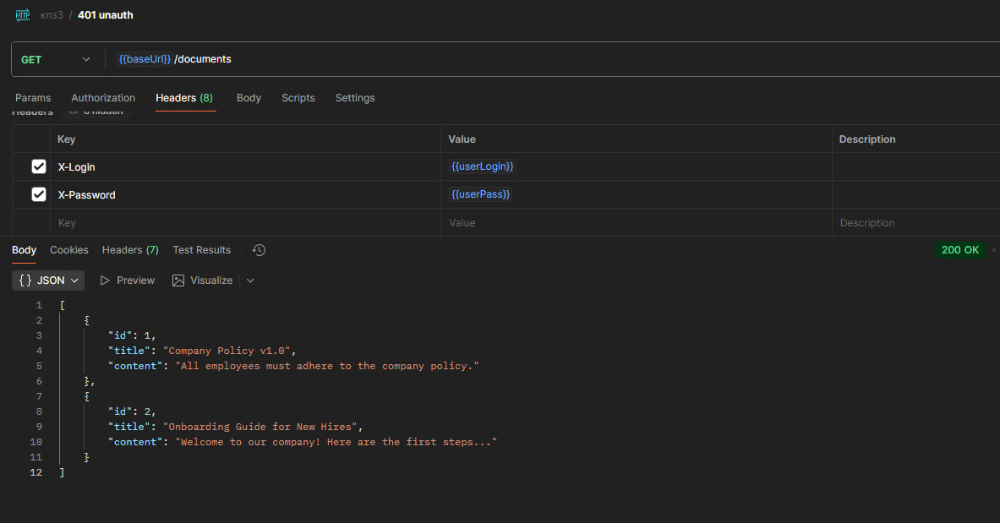
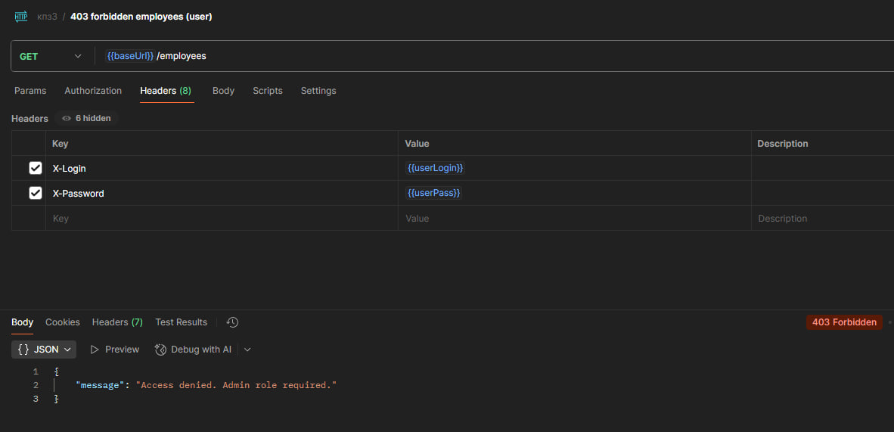
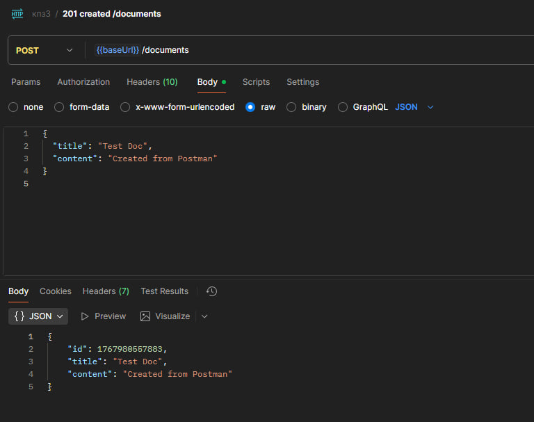
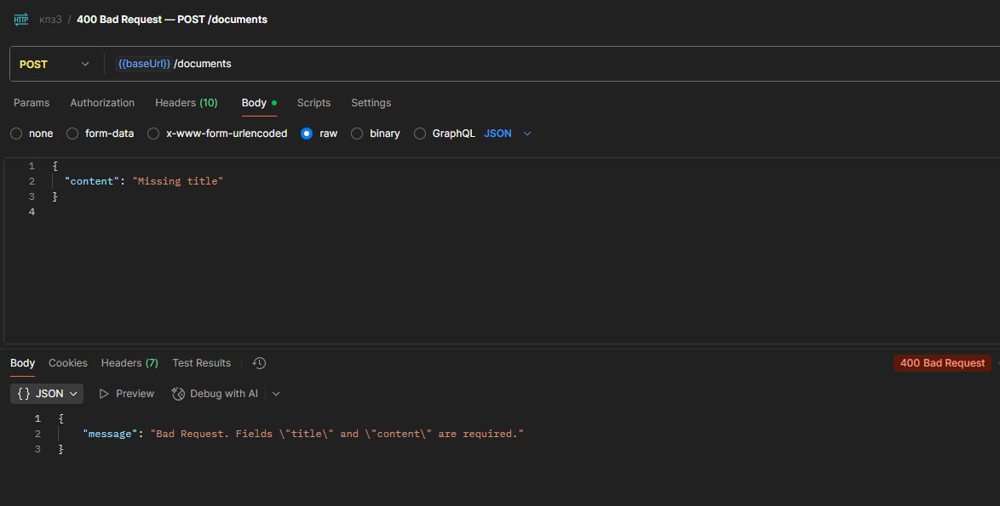
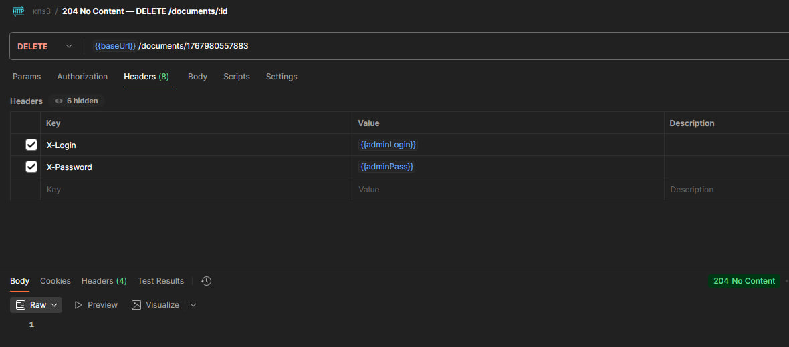

# Лабораторно-практична робота №3

## Розробка та тестування захищеного REST API на Node.js та Express

Цей проєкт демонструє розробку REST API на Node.js + Express з базовими механізмами безпеки:

- аутентифікація за логіном/паролем через HTTP-заголовки;
- авторизація за ролями (доступ до конфіденційного ресурсу лише для `admin`);
- логування кожного запиту (метод + URL + timestamp);
- тестування через Postman та Node.js-скрипт.

API працює з двома ресурсами, що зберігаються в пам’яті (in-memory) у `data.js`:

- `documents` — список документів;
- `employees` — список співробітників (конфіденційні дані).

---

## Швидкий старт

Вимоги: Node.js 18+ (у `test-client.js` використовується вбудований `fetch`).

### 1) Встановлення залежностей

```bash
npm install
```

### 2) Запуск сервера

```bash
npm start
```

Сервер стартує на: `http://localhost:3000`

### 3) Запуск тестового клієнта

(сервер має бути запущений окремо (`npm start`)).

```bash
npm test
```

---

## Облікові дані для доступу (Headers)

Аутентифікація виконується через заголовки:

`X-Login`
`X-Password`

Тестові користувачі з `data.js`:

| Логін    | Пароль        | Роль    | Примітка                               |
| -------- | ------------- | ------- | -------------------------------------- |
| `user1`  | `password123` | `user`  | Доступ до `/documents`                 |
| `admin1` | `password123` | `admin` | Доступ до `/documents` та `/employees` |

---

### Таблиця ендпоінтів

| Метод  | URL              | Опис                                            | Потрібні заголовки                     | Приклад Body                                | Можливі відповіді   |
| ------ | ---------------- | ----------------------------------------------- | -------------------------------------- | ------------------------------------------- | ------------------- |
| GET    | `/documents`     | Отримати список документів                      | `X-Login`, `X-Password`                | —                                           | `200`, `401`        |
| POST   | `/documents`     | Створити документ                               | `X-Login`, `X-Password`                | `{ "title": "Test Doc", "content": "..." }` | `201`, `400`, `401` |
| DELETE | `/documents/:id` | Видалити документ за `id`                       | `X-Login`, `X-Password`                | —                                           | `204`, `401`, `404` |
| GET    | `/employees`     | Отримати список співробітників (**admin-only**) | `X-Login`, `X-Password` + роль `admin` | —                                           | `200`, `401`, `403` |

---

## Тестування в Postman та скріншоти

1. `GET /documents` **без заголовків** → `401 Unauthorized`
   
2. `GET /documents` з `user1` → `200 OK`
   
3. `GET /employees` з `user1` → `403 Forbidden`
   
4. `GET /employees` з `admin1` → `200 OK`
   
5. `POST /documents` валідний JSON → `201 Created`
   
6. `POST /documents` без `title` або `content` → `400 Bad Request`
   
7. `DELETE /documents`
   
